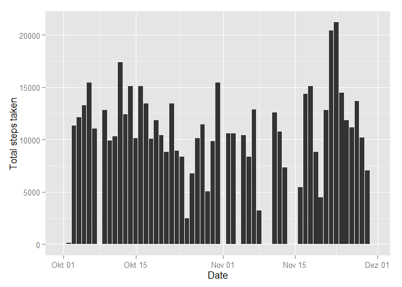
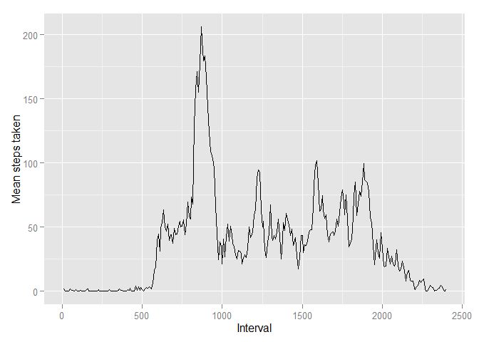
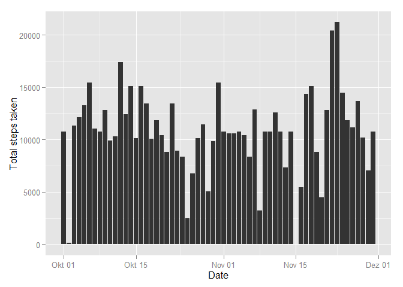
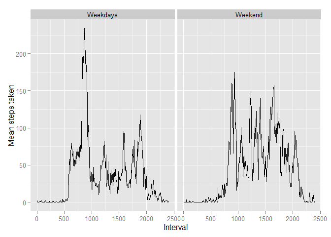

# Reproducible Research: Peer Assessment 1
First, we'll need to make sure that all required packages are loaded.

```r
require(dplyr)
require(ggplot2)

## Loading and preprocessing the data
data <- read.csv("activity.csv")
```
  
  
1. What is the mean total number of steps taken per day?  
  

```r
## I grouped the data, so I could simply run summarize from the
## dplyr package. 
data <- group_by(data,date)
summary <- summarize(data,total_steps = sum(steps, na.rm = TRUE))

## The resulting table serves as input for calculating the mean and
## median.
mean_steps <- mean(summary$total_steps)
median_steps <- median(summary$total_steps)

## To get a nice x-axis, I converted the date column into a date class
summary$date <- as.Date(summary$date)

## This plot shows the total number of steps taken per day over a 
## 2-month period.
g <- ggplot(data=summary, aes(x=date, y=total_steps)) + geom_histogram(stat="identity") + scale_x_date() + xlab ("Date") + ylab("Total steps taken")
g
```

 

```r
## These are the mean and median of the total number of steps
## taken across all days.
sprintf("Mean: %.2f, Median: %d", mean_steps, median_steps)
```

```
## [1] "Mean: 9354.23, Median: 10395"
```
  
  
2. What is the average daily activity pattern?  
  

```r
## Calculate the mean for each interval.
data <- group_by(data,interval)
summary <- summarize(data,activity = mean(steps, na.rm = TRUE))

## Intervals jump between x55 and x00 (e.g. go from 55 straight to 100)
## because the refer to hours and minutes. 
## The solution I used was to create a new column interval2 with a 
## continuous scale, and then adjust the x-axis labels.
summary <- mutate(summary, interval2 = 1:length(interval))

## This plot shows the average steps taken across intervals
g <- ggplot(data=summary, aes(x=interval2, y=activity)) + geom_line() +
    scale_x_continuous(breaks=seq(0, 300, 60), labels = c(0,500, 1000, 1500, 2000, 2500)) + xlab ("Interval") + ylab("Mean steps taken")
g
```

 
  
  
3. Imputing missing values  
  

```r
## Count all NA's
## They would only occur in the column "steps", as the other columns
## contain independent variables
count_na <- sum(is.na(data$steps))

## NA replacement strategy: use mean for that interval
## Why not mean for the day? Because there are days with no values
## whatsoever.
## actually, right now I'm using the overall mean
## However, this results in strange behaviour (mean & median are
## the same)

## Replace NA values in original dataset with means saved in summary
data[is.na(data)] = mean(data$steps, na.rm=TRUE)

data <- group_by(data,date)
summary <- summarize(data,total_steps = sum(steps, na.rm = TRUE))
## The resulting table serves as input for calculating the mean and
## median.
mean_steps <- mean(summary$total_steps)
median_steps <- median(summary$total_steps)

## To get a nice x-axis, I converted the date column into a date class
summary$date <- as.Date(summary$date)

## This plot shows the total number of steps taken per day over a 
## 2-month period.
g <- ggplot(data=summary, aes(x=date, y=total_steps)) + geom_histogram(stat="identity") + scale_x_date() + xlab ("Date") + ylab("Total steps taken")
g
```

 

```r
## These are the mean and median of the total number of steps
## taken across all days.
## Weirdly, they're the same...
## This is probably because I took the mean over the whole dataset
## to fill in the missing values. But hey, that's definitely not
## sophisticated, so should be fine, right?
sprintf("Mean: %.2f, Median: %.2f", mean_steps, median_steps)
```

```
## [1] "Mean: 10766.19, Median: 10766.19"
```
  
  
4. Are there differences in activity patterns between weekdays and weekends?  
  

```r
## Necessary to reload data
data <- read.csv("activity.csv")
data$date <- as.Date(data$date)

## make new variable with weekdays instead of dates
## and turn weekday strings into a factor with two levels
data <- mutate(data, weekdays = weekdays(data$date))

data$weekdays[data$weekdays=="Montag"]<-1
data$weekdays[data$weekdays=="Dienstag"]<-1
data$weekdays[data$weekdays=="Mittwoch"]<-1
data$weekdays[data$weekdays=="Donnerstag"]<-1
data$weekdays[data$weekdays=="Freitag"]<-1
data$weekdays[data$weekdays=="Samstag"]<-2
data$weekdays[data$weekdays=="Sonntag"]<-2

data$weekdays <- factor(data$weekdays, labels = c("Weekdays", "Weekend"))
data <- group_by(data,interval,weekdays)

## Calculate mean steps for each interval
summary <- summarize(data,activity = mean(steps, na.rm = TRUE))

## Put dataset in the right order
summary <- summary[order(summary$weekdays, summary$interval),]

## add interval variable for correct display of x-axis, for each
## category of weekdays
summary <- group_by(summary,weekdays)
summary <- mutate(summary, interval2 = 1:length(interval))

## This plot displays the mean steps taken for weekdays and weekend.

g <- ggplot(data=summary, aes(x=interval2, y=activity)) + geom_line() + facet_grid(. ~ weekdays) + scale_x_continuous(breaks=seq(0, 300, 60), labels = c(0,500, 1000, 1500, 2000, 2500))  + xlab ("Interval") + ylab("Mean steps taken")
g
```

 
